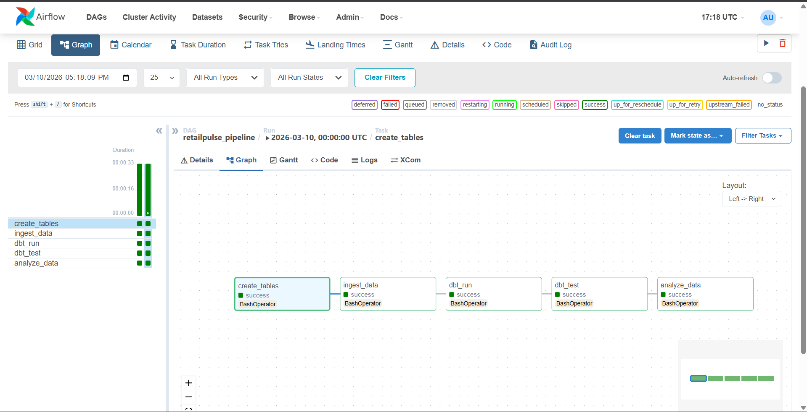
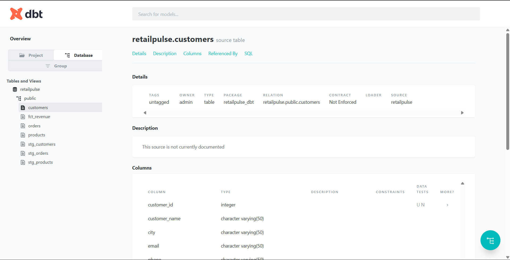
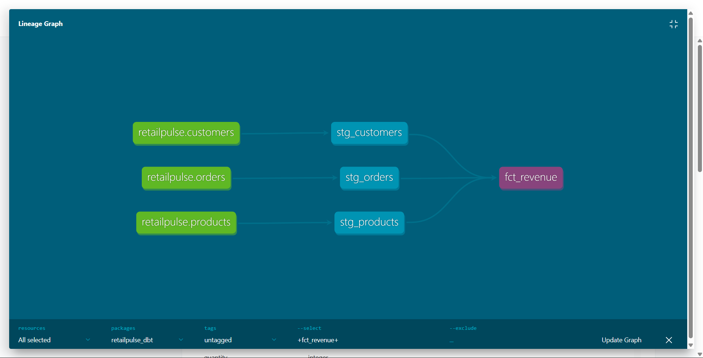
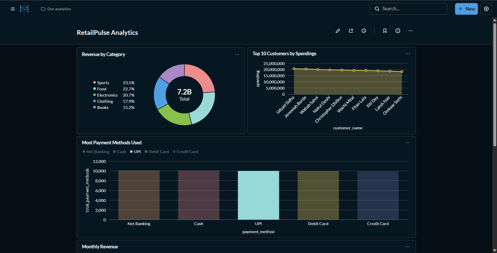
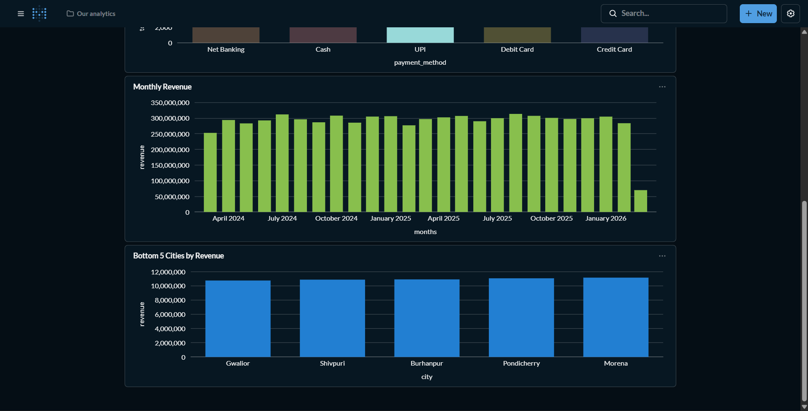

# 🛒 RetailPulse — Production-Grade ELT Data Pipeline

<div align="center">


**A fully automated, containerized retail analytics pipeline — built to simulate real-world data engineering at scale.**

</div>

---

## 📌 Project Overview

RetailPulse is an end-to-end **ELT (Extract, Load, Transform)** data pipeline that ingests, transforms, tests, and visualizes retail sales data. It simulates the kind of data infrastructure used by e-commerce and retail companies to track revenue, customer behaviour, product performance, and payment trends.

The project was built from scratch with production best practices in mind — including containerization, automated testing, orchestration, CI/CD, and a live business intelligence dashboard.

> 💡 **Why ELT instead of ETL?**
> Modern data engineering favors ELT — load raw data first, then transform it inside the warehouse. This is faster, more scalable, and allows analysts to re-transform data anytime without re-ingesting it.

---

## 🏗️ Architecture

```
┌─────────────────────────────────────────────────────────────────┐
│                        RetailPulse Pipeline                     │
│                                                                 │
│  📄 CSV Files         🐘 PostgreSQL        🔁 dbt              │
│  ┌──────────┐        ┌──────────────┐     ┌─────────────────┐  │
│  │customers │──────▶ │  Raw Tables  │────▶│ Staging Models  │  │
│  │products  │        │  customers   │     │ stg_customers   │  │
│  │orders    │        │  products    │     │ stg_products    │  │
│  └──────────┘        │  orders      │     │ stg_orders      │  │
│                      └──────────────┘     └────────┬────────┘  │
│                                                    │            │
│                                           ┌────────▼────────┐  │
│                                           │  Mart Models    │  │
│                                           │  fct_revenue    │  │
│                                           └────────┬────────┘  │
│                                                    │            │
│  📊 Metabase          ✅ dbt Tests        🎯 Airflow DAG       │
│  Live Dashboard  ◀── fct_revenue  ◀────  Orchestrates All     │
└─────────────────────────────────────────────────────────────────┘

```

# ⚙️ Tech Stack

| Tool | Purpose | Why We Used It |
|------|---------|----------------|
| **Python** | Data generation & ingestion | Industry standard for data engineering scripts |
| **PostgreSQL** | Data warehouse | Reliable, open-source relational database |
| **dbt** | Data transformation & testing | Best-in-class SQL transformation tool used by top companies |
| **Apache Airflow** | Pipeline orchestration | Industry standard for scheduling and monitoring pipelines |
| **Metabase** | BI Dashboard | Open-source, easy-to-use business intelligence tool |
| **Docker & Compose** | Containerization | Ensures the pipeline runs identically on any machine |
| **GitHub Actions** | CI/CD | Automatically runs dbt tests on every code push |
| **Faker** | Realistic data generation | Generates Indian retail data for simulation |

---

## 📊 Data Model

### Source Tables (Raw)
| Table | Rows | Description |
|-------|------|-------------|
| `customers` | 500 | Indian customer profiles (name, city, email, phone) |
| `products` | 50 | Products across 5 categories (Electronics, Clothing, Food, Books, Sports) |
| `orders` | 50,000 | 2 years of sales transactions with payment methods |

### dbt Staging Models
| Model | Description |
|-------|-------------|
| `stg_customers` | Cleaned customer data |
| `stg_products` | Cleaned product data with categories |
| `stg_orders` | Cleaned orders with date parsing |

### dbt Mart Models
| Model | Description |
|-------|-------------|
| `fct_revenue` | Joined fact table — orders + products + customers with revenue calculation |

---

## 🔁 Airflow Pipeline

The DAG `retailpulse_pipeline` runs **5 tasks automatically every day**:

```
create_tables ──▶ ingest_data ──▶ dbt_run ──▶ dbt_test ──▶ analyze_data
```

| Task | What It Does |
|------|-------------|
| `create_tables` | Creates PostgreSQL schema if not exists |
| `ingest_data` | Loads CSV data into raw tables |
| `dbt_run` | Transforms raw data through staging → marts |
| `dbt_test` | Runs 6 automated data quality tests |
| `analyze_data` | Generates business revenue reports |

---

## ✅ Data Quality Tests

dbt automatically runs **6 data quality tests** on every pipeline run:

- ✅ `customer_id` is unique
- ✅ `customer_id` is not null
- ✅ `product_id` is unique
- ✅ `product_id` is not null
- ✅ `order_id` is unique
- ✅ `order_id` is not null

---

## Airflow Pipeline

- Create_table from db.py.
- Ingest Data from ingestion.py.
- dbt run Command to Automatically run dbt Model.
- Analyze_Data from analysis.py.



## dbt Server

- dbt Server with Schema Structure.




## dbt Lineage Graph

- Graph with Connected Fregments.



## Metabase Dashboard Chart 1

- Revenue by Category.
- Top 10 Customers by Spendings.
- Most Payment Methods Used.



## Metabase Dashboard Chart 2

- Monthly Revenue.
- Bottom 5 Citites by Revenue.



## CI/CD Pipeline

- To perform Push to know if Everything Works Fine or not.


# 🚀 How to Run Locally

### Prerequisites
- Docker Desktop installed
- Python 3.10+
- Git

### Steps

**1. Clone the repository**
```bash
git clone https://github.com/kartikeyvashist/retailpulse.git
cd retailpulse
```

**2. Create your `.env` file**
```bash
cp .env.example .env
```

**3. Start all containers**
```bash
docker compose up -d
```

**4. Set up the database**
```bash
python db.py
python generate_data.py
python ingestion.py
```

**5. Open Airflow**
- Go to `http://localhost:8080`
- Login: `admin` / `admin123`
- Trigger the `retailpulse_pipeline` DAG

**6. Open Metabase Dashboard**
- Go to `http://localhost:3000`

**7. View dbt Documentation**
```bash
cd retailpulse_dbt
dbt docs generate
dbt docs serve
```
- Go to `http://localhost:8080`

---

## 🛠️ Troubleshooting

### ❌ Port 5432 already in use
If you have PostgreSQL installed locally on Windows, it may conflict with Docker.
1. Press `Windows + R` → type `services.msc`
2. Find **PostgreSQL Server 18** → Right click → **Properties**
3. Change Startup type to **Disabled** → Click **Stop**

### ❌ dbt command not found (Windows)
Run this in PowerShell to fix the PATH:
```powershell
Set-Alias dbt "C:\Users\<your_username>\AppData\Local\Packages\PythonSoftwareFoundation.Python.3.13_qbz5n2kfra8p0\LocalCache\local-packages\Python313\Scripts\dbt.exe"
```

### ❌ Airflow shows "You need to initialize the database"
Run:
```bash
docker compose up airflow-init
docker compose up -d
```
Then create admin user:
```bash
docker exec -it airflow-webserver airflow users create --username admin --password admin123 --firstname Admin --lastname User --role Admin --email admin@retailpulse.com
```

### ❌ dbt can't connect inside Airflow container
The profiles.yml inside the container must use container name not localhost:
```bash
docker exec -it airflow-scheduler bash -c "sed -i 's/127.0.0.1/retailpulse-db/g' /home/airflow/.dbt/profiles.yml"
```

### ❌ CSV encoding error during ingestion
If you see `UnicodeDecodeError`, make sure your `open()` calls use:
```python
open('file.csv', 'r', encoding='utf-8', errors='ignore')
```

### ❌ After every `docker compose down`, you need to:
1. Run `python db.py`
2. Run `python generate_data.py`  
3. Run `python ingestion.py`
4. Reinstall dbt in container: `docker exec -it airflow-scheduler bash -c "pip install dbt-core dbt-postgres"`
5. Copy dbt project: `docker cp retailpulse_dbt airflow-scheduler:/opt/airflow/dags/`
6. Fix permissions: `docker exec -it --user root airflow-scheduler bash -c "chmod -R 777 /opt/airflow/dags/retailpulse_dbt"`
7. Fix profiles host: `docker exec -it airflow-scheduler bash -c "sed -i 's/127.0.0.1/retailpulse-db/g' /home/airflow/.dbt/profiles.yml"`

## 💼 Business Value

RetailPulse answers real business questions that retail companies care about:

- 📈 **Which products generate the most revenue?**
- 🏙️ **Which cities are underperforming?**
- 💳 **What payment methods do customers prefer?**
- 👤 **Who are the top spending customers?**
- 📅 **What does monthly revenue trend look like?**

These insights help companies make data-driven decisions around inventory, marketing spend, and regional expansion.

---

## 🔐 Security

- All credentials stored in `.env` file (never committed to GitHub)
- `.env` is listed in `.gitignore`
- Docker secrets managed via environment variables

---

## 👨‍💻 Author

**Kartikey Vashist**


[](https://www.linkedin.com/in/kartikey-vashist-3394b5347)
[](mailto:kartikeyvashistxyz@gmail.com)
[](https://github.com/kartikeyvashist)

---

## 📄 License

This project is open source and available under the [MIT License](LICENSE).

